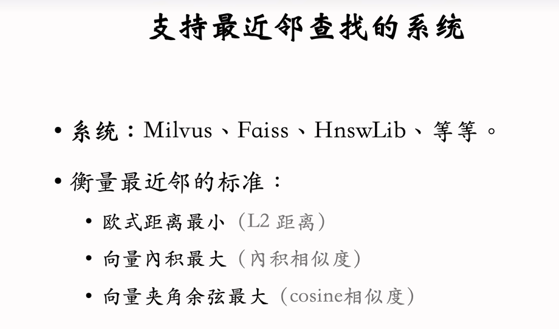

### 推荐系统基本链路：

策略/模型/画像/工程

### 召回模块
1.矩阵补充模型

缺点1： id Embeding不够！

缺点2：负样本的选择方式不太对：

正样本：曝光后有正交互（这是对的）

负样本：曝光后没交互（这是不对的！！！）

缺点3：内积不如余弦相似度，平方损失（回归）  不如  交叉熵损失函数（分类）

多说一嘴，其实torch里的embeding不一定是最好的，当量级上去后还需要用一些trick来做。

线上细节

#### 近似最近邻查找

将向量数据通过余弦相似度划分为k个区域，每个区域用单位向量示意，拿到用户的id向量后只需要对比k个单位向量的相似度，取最相近的
区域！

1

2.双塔模型
为什么把id也当作特征呢？为什么id当作特征也有效呢？
相对于其他特征，user id和item id更像是独有的特征，
唯一标识某个用户或者物料，模型通过对其数据的学习，
能够学习到某个用户或者物料独有的匹配模式，从而达到增强个性化能力。
反之，如果没有这类特征，比如用户年龄和物料类型等一些通用特征，模
型学习到的更像是一种大众化的规则，比如年轻人通常会喜欢什么类型的item，
但这是模型从大量数据中总结出来的通用的规则，并不代表所有的年轻人都喜欢这个类型的item。
不过某些用户或者物料本身数据很少，对应的embedding学习的不充分，这种时候是不是反而会影响效果。
根据数据量决定某个user id或者item id是否需要作为特征会不会更优一点，这个我自己还没有尝试过，可能其他人已经实验过了。

关于item/usercf的一些小trick
[神秘连接](https://pytorch.org/tutorials/)

思考：用id做embeding的时候 线上新加入的id怎么办呢？Embeding层维度岂不是会改变吗？怎么处理的呢？

### 用户画像

